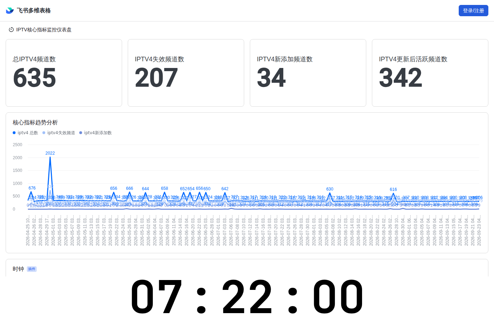

# IPTV M3U 播放列表

自动更新 IPTV 频道列表，每日检测可用性并去重汇总。  
**频道按字母顺序排列，失效频道自动移入 `*_dead.m3u`，恢复后自动回归。**

## 📊 本次更新报告

**更新时间**: 2026-09-06 04:00:59 (UTC+8)

### 源 1: iptv4.m3u（央视频道/卫视频道/地方频道）→ `index.m3u`

| 项目 | 数量 |
|------|------|
| 远程总频道数 | 408 |
| 符合分类条件的频道 | 255 |
| 更新前活跃频道 | 310 |
| **更新后活跃频道** | **308** |
| 失效频道数 | 176 |
| 本次净增 | 0 |
| **累计总数** | **308** |

- 活跃列表：[`index.m3u`](./index.m3u)  
- 失效列表：[`index_dead.m3u`](./index_dead.m3u)

### 源 2: iptv-org（国际频道）→ `iptv-org.m3u`

| 项目 | 数量 |
|------|------|
| 远程总频道数 | 12140 |
| 更新前活跃频道 | 7387 |
| **更新后活跃频道** | **7480** |
| 失效频道数 | 8673 |
| 本次净增 | 93 |
| **累计总数** | **7480** |

- 活跃列表：[`iptv-org.m3u`](./iptv-org.m3u)  
- 失效列表：[`iptv-org_dead.m3u`](./iptv-org_dead.m3u)

## 🕐 更新频率

本仓库通过 GitHub Actions 每日自动更新（北京时间凌晨 2:00）。

---
*最后更新: 2026-09-06 04:00:59*

## 📸 仪表盘截图

# 捐赠|Donate

